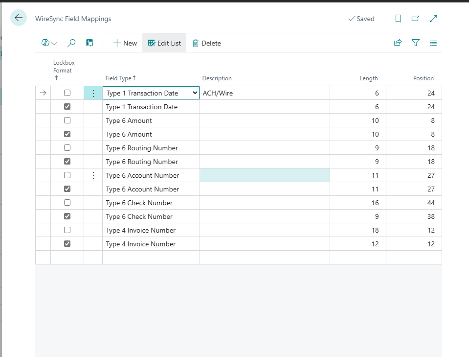

# WireSync Field Mappings

The **WireSync Field Mappings** page allows you to define how fixed-length fields in incoming bank files (ACH, Wire, Lockbox) map to the expected data fields in Business Central.

This configuration ensures that the parsing engine can correctly extract critical data such as transaction dates, amounts, routing numbers, check numbers, and invoice numbers from each line in the file.

Each row in the mapping table defines:
- The type of record line (e.g., Type 1, Type 4, Type 6)
- The field's purpose (e.g., Amount, Invoice Number)
- The length and position (offset) of the field in the fixed-length format

---

## Columns

### Lockbox Format
- **Type:** Boolean
- **Description:** Indicates whether the mapping applies to Lockbox file formats. If unchecked, the mapping is for ACH/Wire files.

---

### Field Type
- **Type:** Enum/Text
- **Examples:**
  - `Type 1 Transaction Date`
  - `Type 6 Amount`
  - `Type 6 Routing Number`
- **Description:** Defines the type of record line and the field being extracted from that line.

---

### Description
- **Type:** Text
- **Example:** `ACH/Wire`
- **Description:** Optional label for clarity. This can describe the file type or usage notes.

---

### Length
- **Type:** Integer
- **Description:** Number of characters the field occupies in the fixed-length record.

---

### Position
- **Type:** Integer
- **Description:** The starting character position (1-based index) of the field in the record line.

---

## How It Works

During import, WireSync reads each line of the bank file and checks the record type (e.g., Type 1, Type 4, Type 6). It then uses the field mappings to:
- Extract substrings from the line based on the configured `Length` and `Position`
- Assign those substrings to internal data fields
- Match and apply transactions using the parsed data

---

## Example

| Field Type               | Length | Position |
|--------------------------|--------|----------|
| Type 6 Amount            | 10     | 8        |
| Type 6 Routing Number    | 9      | 18       |
| Type 6 Account Number    | 11     | 27       |
| Type 6 Check Number      | 16     | 44       |
| Type 4 Invoice Number    | 12     | 12       |

This configuration means that WireSync will extract a 10-character amount field starting at position 8 from any Type 6 line in the file.

---

## Best Practices

- Ensure each required field for identifying payments and matching invoices is properly mapped.
- Use different mappings for ACH/Wire vs. Lockbox formats as needed.
- Confirm field positions with your bank’s file layout specifications.

---

## Related Pages

- [WireSync Setup](./wiresync-setup.md)
- [WireSync Files](./wiresync-files.md)
- [WireSync Invoice Logs](./wiresync-invoice-log.md)
