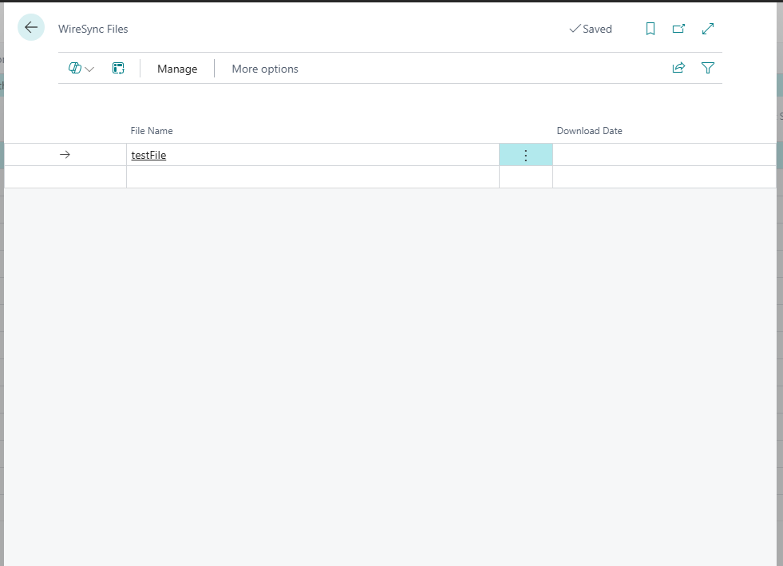

# WireSync Files

The **WireSync Files** page displays a list of bank transmission files retrieved from the configured SFTP service. This page serves as both a history of imported files and a utility interface for manually managing those files.

Each row represents a single file fetched from the remote server, typically in BAI or similar formats, and includes options to trigger re-processing.

## Columns

### File Name
- **Description:** The name of the file retrieved from the remote SFTP server.
- **Example:** `testFile`
- **Note:** This typically corresponds to a file in the configured Bank Network Path (as set on the WireSync Setup page).

---

### Download Date
- **Description:** The date and time when the file was originally downloaded from the SFTP server.
- **Note:** If blank, the file may not have been downloaded or processed yet.

---

## Actions

### Manage Button
Clicking **Manage** provides actions for:
- **Manual File Import**: Select a file from the SFTP server and import it on demand.
- **Re-Process File**: Allows you to re-run the import logic on a previously downloaded file in case of updates or issues with the original import.

---

## Usage Tips

- Use this page to verify whether files were successfully retrieved and processed.
- Re-processing a file can be helpful if a configuration issue was corrected or journal batches were manually cleared.
- Files that appear with a missing **Download Date** may indicate connection issues, unsupported file formats, or that the file hasn’t yet been processed.

---

## Related Setup

Ensure the following setup items are correctly configured in the [WireSync Setup](./wiresync-setup.md) page:
- **Azure SFTP URI**
- **Bank Network Path**
- **Azure Secret Key**

These must be valid for files to appear here.
