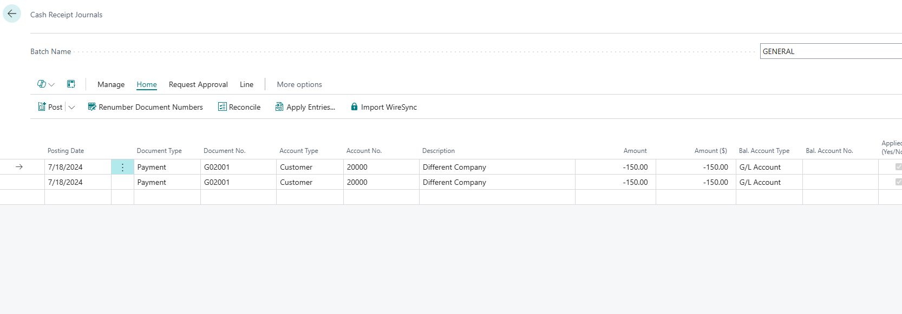

# Importing Payments via Cash Receipt Journal

The **Cash Receipt Journal** in Business Central is where WireSync ultimately delivers imported payments. Once the system has pulled and parsed the bank file using the setup and mappings, the results are posted into this journal for review, posting, or additional processing.

WireSync adds a custom action to this page: **Import WireSync**, which pulls together all configuration and mapping logic and generates entries based on matched data.

---

## Key Feature: Import WireSync Button

- **Location:** Top action bar of the Cash Receipt Journal
- **Purpose:** Initiates the WireSync import process, applying all previously defined configuration, field mappings, and invoice matching logic
- **Result:** Automatically creates cash receipt journal lines for customers with properly applied payments

---

## What Happens When You Click "Import WireSync"?

1. Connects to the SFTP server defined in [WireSync Setup](./wiresync-setup.md) 2. Locates files in the defined **Bank Network Path** 3. Uses [Field Mappings](./wiresync-field-mappings.md) to parse and extract necessary values from BAI-formatted lines 4. Tries to match payments to existing **Customer** records and **Invoices** 5. Inserts successful transactions into the selected Cash Receipt Journal batch 6. Logs unmatched invoices in the [Invoice
Log](./wiresync-invoice-log.md) for follow-up

---

## Journal Fields Populated

| Field         | Source                            |
|---------------|------------------------------------|
| **Posting Date** | File parsing logic or system date |
| **Document Type** | Usually `Payment`                |
| **Document No.**  | Based on bank file or template    |
| **Account Type**  | `Customer`                      |
| **Account No.**   | Mapped from bank file            |
| **Description**   | Free-text from file or default   |

---

## Best Practices

- **Always review imported lines** before posting. You may still need to manually adjust unmatched entries or descriptions.
- **Run in Test Mode first** (see [WireSync
Setup](./wiresync-setup.md)) to simulate file processing before committing data.
- Use **Reconcile** and **Apply Entries** actions after import to finalize application of payments to open invoices.

---

## Related Pages

- [WireSync Setup](./wiresync-setup.md)
- [WireSync Files](./wiresync-files.md)
- [WireSync Field Mappings](./wiresync-field-mappings.md)
- [WireSync Invoice Logs](./wiresync-invoice-log.md)
