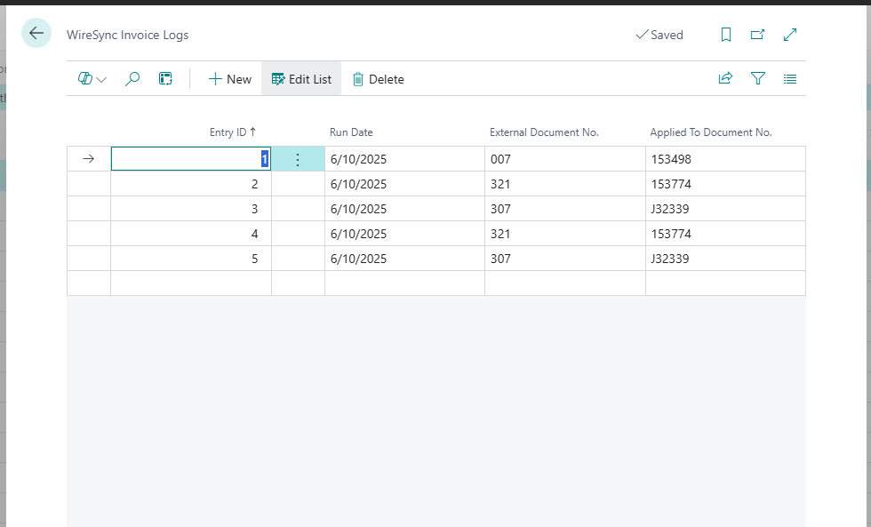

# WireSync Invoice Logs

The **WireSync Invoice Logs** page displays a log of invoice entries from imported bank files that could not be automatically matched to existing documents in Business Central. This screen is a critical tool for identifying and resolving data mismatches during the cash receipt import process.

Use this log to manually review and correct invoices that failed to apply due to missing or mismatched document numbers.

---

## Purpose

This log is designed to:
- Track failed or partial invoice applications from WireSync imports.
- Help users identify documents that require manual intervention.
- Serve as a historical audit trail for unmatched invoice transactions.

---

## Columns

### Entry ID
- **Type:** Auto-generated identifier
- **Description:** A unique ID assigned to each invoice log entry.

---

### Run Date
- **Type:** Date
- **Description:** The date the WireSync process was executed for the related bank file.

---

### External Document No.
- **Type:** Text
- **Example:** `007`, `321`, `307`
- **Description:** The invoice number or reference found in the imported bank file (e.g., from ACH/Wire/Lockbox).

---

### Applied to Document No.
- **Type:** Text
- **Example:** `153498`, `J32339`
- **Description:** The Business Central document that the system attempted (or failed) to apply the external invoice to. If this field is blank or incorrect, it may indicate a mapping issue.

---

## Troubleshooting Tips

- Compare the **External Document No.** to known invoices in Business Central.
- Confirm that invoice numbers in the bank files exactly match the values in BC (case, padding, or spacing differences can cause mismatches).
- Consider enhancing mapping rules or logic if recurring mismatches follow a pattern.

---

## Next Steps

- Manually apply unmatched payments in the Cash Receipt Journal if needed.
- Reprocess corrected files after resolving mapping or master data issues.
- For persistent issues, contact your WireSync administrator or developer to review parsing logic.

---

## Related Pages

- [WireSync Files](./wiresync-files.md)
- [WireSync Setup](./wiresync-setup.md)
