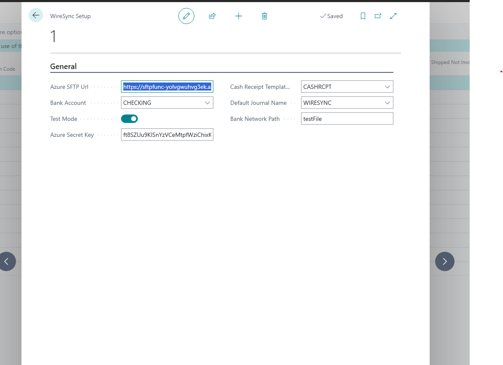

# WireSync Setup

The **WireSync Setup** page is used to configure the core settings that enable WireSync to connect securely to your bank's SFTP service and import incoming ACH, Wire, or Lockbox payments in BAI-format into Business Central Cash Receipts.

This setup must be completed before using the WireSync import process.

## Fields

### Azure SFTP URI
- **Type:** Text
- **Description:** The full SFTP endpoint URL where bank files are uploaded. This is typically an Azure SFTP Function App or an SFTP gateway used to securely transmit BAI files from your bank.

---

### Azure Secret Key
- **Type:** Text (Sensitive)
- **Description:** The secret key or token used to authenticate against the SFTP service. This value is stored securely and should be kept confidential.

---

### Test Mode
- **Type:** Toggle (Yes/No)
- **Default:** Off
- **Description:** When enabled, WireSync simulates imports without creating actual cash receipt journals. Use this mode for testing connectivity and file parsing without affecting data.

---

### Bank Account
- **Type:** Lookup (Bank Account List)
- **Example:** `CHECKING`
- **Description:** Specifies the default Business Central bank account where imported transactions will be posted.

---

### Cash Receipt Template
- **Type:** Lookup (Gen. Journal Template)
- **Example:** `CASHRCPT`
- **Description:** Defines the General Journal Template that will be used when creating the cash receipt journals.

---

### Default Journal Name
- **Type:** Lookup (Gen. Journal Batch)
- **Example:** `WIRESYNC`
- **Description:** Specifies the default journal batch name where imported transactions will be posted. Make sure this batch exists under the selected template.

---

### Bank Network Path
- **Type:** Text
- **Example:** `/outbound`
- **Description:** The folder or virtual path on the SFTP server where incoming BAI files are expected. This helps the extension know where to look for incoming files.

---

## Additional Notes

- Ensure the Azure Secret Key and SFTP URL are correctly configured and tested before scheduling automated imports.
- You can use the **Test Mode** toggle to safely simulate the connection and import process.
- It's recommended to create a dedicated journal batch (`WIRESYNC`) to help separate these entries from manually created ones.

